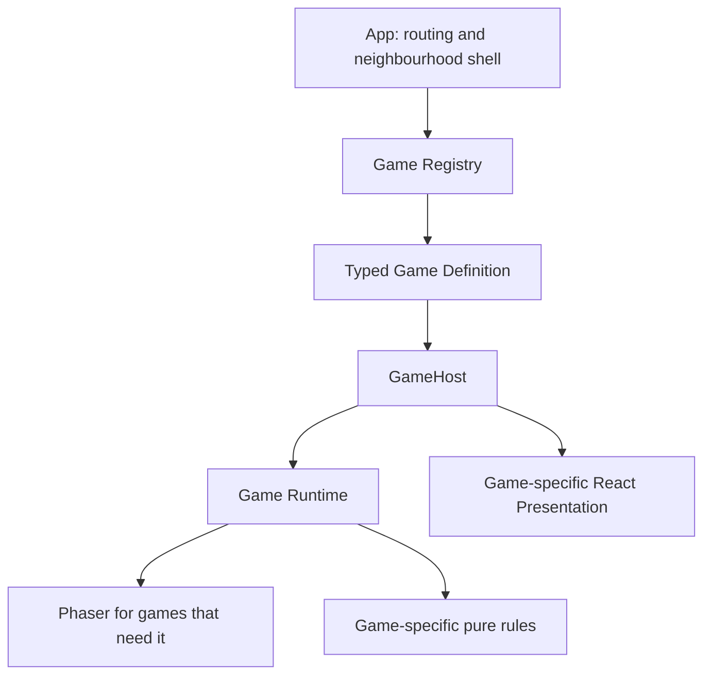

# Architecture

Gully Games has an application shell, an internal registry and independent game modules. No backend or universal game engine is needed.

## Responsibilities

- **App** (`src/app`): server rendering, routing, navigation, metadata and overall shell. It reads a serializable catalog and passes IDs to the client launcher. No runtime loader or component crosses server props.
- **Core contracts** (`src/games/core/contracts.ts`): metadata, players, results, lifecycle-only base state and generic runtime/definition contracts. `BaseGameState` has status and an optional result. Scores in a result are optional so unscored games work. No turns, phases, rounds or flick power live here.
- **React UI contract** (`src/games/core/game-ui.ts`): a typed runtime/presentation pairing. This type-only module uses React types; the runtime contracts and controller have no React runtime dependency.
- **Registry**: unique IDs, immutable metadata and registered component discovery. Playable registrations must have a component. Planned metadata has no runtime. Adding a definition requires one registration, not host conditionals.
- **GameHost**: a generic client component that loads/mounts a runtime, receives correctly typed state, renders the definition's presentation, owns cleanup, and provides loading/friendly error feedback. It knows no game rules, controls or layout dimensions.
- **Game module**: game-specific state, rules, runtime, presentation, metadata and tests. Pen Fight owns its scores, round, Side, PenFightPhase, power, CPU, match progression and notebook instructions.

`GameDefinition<TState>` declares `loadRuntime()`. `ReactGameDefinition<TState>` adds `Presentation`, whose props carry `TState | null`, restart availability, a restart callback and host-owned surface/loading content as children. The presentation owns layout around that surface, including logical aspect ratio and game-specific instructions. React presentation does not run simulation rules.

`registerGame` closes over a typed definition in a component before placing it in the heterogeneous registry. This preserves each runtime/UI state pairing without casting every game to one state, using `any`, or maintaining a union of future games. `GameLauncher` resolves the ID and renders that component; GameHost itself remains generic. Registered component and game keys give different games separate React lifetimes.

## Lifecycle and errors

One host effect owns one `createRuntimeController`. Loading starts in a microtask; disposed effects cannot begin loading or mount a late import. State and errors after failure/disposal are ignored. Mount exceptions and load failures retain a typed diagnostic phase and unknown cause. Runtime callbacks can report fatal errors; the controller releases ownership and disables controls. Errors are friendly in UI and logged with cause in development. Restart exceptions also release the runtime. Dispose is idempotent; teardown failures log in development without updating an unmounted host.

The minimal runtime lifecycle remains `restart()` and `destroy()`. No save, pause, networking or global state framework is added. If mount throws after allocating resources, the runtime must roll back its own setup, since the host has no returned lifecycle to destroy.

Pen Fight disconnects its ResizeObserver, suppresses late reporting, stops active scenes, removes the canvas immediately, and calls Phaser `destroy(true)`. Phaser releases engine resources on its next frame, with `noReturn` left false so another game can mount. Scene shutdown/destruction removes browser, pointer and keyboard handlers; Phaser owns scene timers, events and physics. Restart clears round/CPU timers and resets bodies and scores. Resize refreshes scale only and never restarts simulation.

Phaser 3.90 requires a narrowly isolated visibility cleanup adapter. See [the investigation and upgrade checklist](phaser-lifecycle.md). This is version-specific engineering debt, not a universal engine abstraction.

## Pen Fight behavior

900 × 540 logical coordinates, Scale.FIT, CENTER_BOTH, zero gravity, rectangular bodies, friction and restitution remain intact. A 76-unit pick radius supports touch. An active pointer alone controls aiming. Outside release, pointer/touch cancellation, page hiding and Esc cancel aiming.

Both bodies must have low linear/angular speed for 450ms; a 12-second safety limit stops pathological movement. Results then handle either or both pens falling. Draws replay; first to three wins in at most five decisive rounds. The opening side alternates by decisive round number.

**Gameplay debt:** a pen falls when its centre strictly crosses a desk edge; equality stays on the desk. This pure predicate is tested, and falling is latched until reset. It is deterministic but does not model a long rotating pen partly hanging off the desk. A later improvement may calculate body/desk overlap or use fall zones/body bounds so visual support and falling agree. No such enhancement belongs in this refactor.

## Verification, PWA and accessibility

Vitest covers pure rules, registry invariants, state typing and controller races. Happy DOM plus real React `act`/createRoot tests cover host effects, StrictMode replay, remounts, friendly errors and non-physics state. Phaser renderer behavior is not simulated in Happy DOM: adapter tests use a small facade reproducing the inspected upstream lifecycle, and browser checks verify real instances, listeners, timers, observers and canvases. No pixel assertions are used.

CI runs npm ci, strict type checking, lint, tests, formatting and production build on pushes and pull requests using Node 24 LTS. Local browser verification remains separate from these simple gates.

The existing native PWA remains unchanged: manifest/icons, production-only service worker, network-first navigation, cache-first immutable chunks and offline fallback. Offline play requires a controlled visit with the game's chunks loaded. New worker versions wait naturally; deployment/cache updates need ongoing validation.

Labels, live status messages, unique meter IDs, disabled/loading controls, visible focus and Esc behavior support the surrounding UI. The canvas is **not** fully accessible. Alternative interactions and real-device keyboard/screen-reader testing remain platform concerns as games are added.

**Do not extract shared gameplay mechanics until at least two games demonstrate the same abstraction.** In particular, do not introduce a FlickEngine before Pen Fight and Kanche independently demonstrate a useful shared interface.
